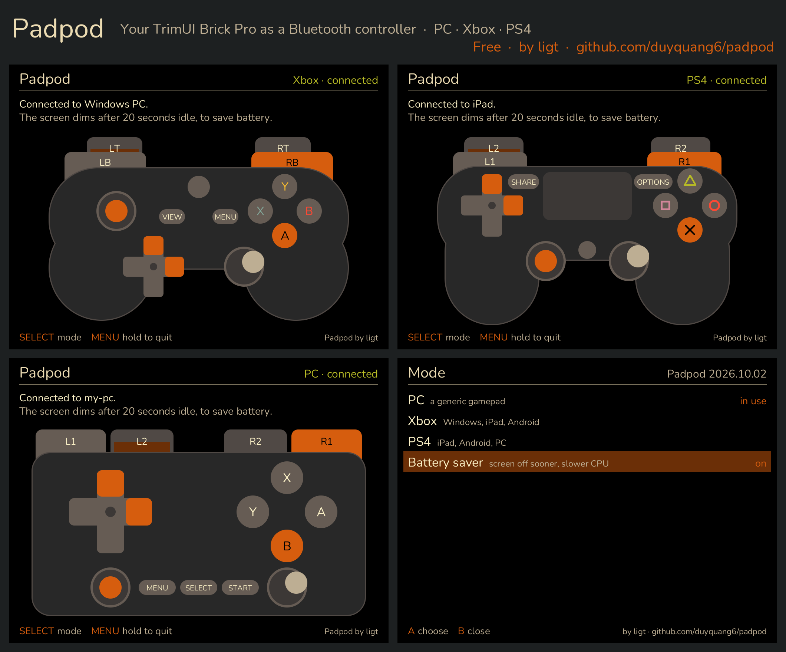

# Padpod

Padpod turns a **TrimUI Brick Pro** into a Bluetooth game controller. It is
one static aarch64-musl binary that draws straight to the framebuffer, reads
the handheld's own buttons and sticks, and stands in for the system's
Bluetooth daemon while it runs.



## Download and install

Pick the archive for your firmware from **[the latest release](../../releases/latest)**. That
page is Padpod's official source, and lists each archive's SHA-256 checksum in
`SHA256SUMS.txt`: if you got Padpod anywhere else, check it against that list
(`sha256sum Padpod-*.zip`) before installing.

| Firmware | File |
|---|---|
| [spruceOS](https://github.com/spruceUI/spruceOS) | `Padpod-<version>-spruceOS.zip` |
| stock TrimUI | `Padpod-<version>-stockOS.zip` |

1. Unzip onto the root of the SD card, and merge the folder when asked. The
   archive already holds the right one for your firmware: `App/Padpod` for
   spruceOS, `Apps/Padpod` for stock TrimUI.
2. Turn Bluetooth on in the firmware's settings.
3. Open **Padpod**.

Padpod is developed and tested on spruceOS; the stock-firmware build is the
same program and has not been tested on stock firmware yet.

## Modes

Press **SELECT** while nothing is connected to choose one.

| Mode | What the handheld becomes | For |
|---|---|---|
| **PC** | A standard Bluetooth HID gamepad | Windows, Linux, macOS, Android - no driver |
| **Xbox** | An Xbox Wireless Controller | Windows games as XInput, iPad, Android |
| **PS4** | A DualShock 4 | iPad and its games, Android, PC |

To pair, open Bluetooth settings on the host and choose the name the screen
shows. Afterwards the handheld reconnects to that host by itself.

The screen lights each control as it is pressed and dims itself once a host
is connected. **Battery saver** in the same menu turns the screen off sooner
and slows the CPU while idle. Hold **MENU** for two seconds to quit; tap it
for the controller's Home, PS or Xbox button. Rumble works in the Xbox and
PS4 modes.

## Build from source

```sh
cargo test --workspace
cargo build --release --target aarch64-unknown-linux-musl -p padpod
HOST=root@<device-ip> ./apps/padpod/deploy/deploy.sh   # install over SSH; no default host on purpose
VERSION=2026.10.02 ./apps/padpod/deploy/package.sh    # the release archives, in dist/
```

Cross-compiling needs nothing beyond rustup's `aarch64-unknown-linux-musl`
target: `.cargo/config.toml` points the linker at `rust-lld`. The deploy
script installs to `/mnt/SDCARD/App/Padpod` over SSH; the app then appears in
spruce's App list.

`crates/brick` holds what Padpod shares with its sibling apps: the panel,
text, the buttons and screenshots.

## License and credits

Padpod is source-available for **noncommercial use**, under the
[PolyForm Noncommercial License 1.0.0](LICENSE.md). You may use, change and
share it for personal and other noncommercial purposes, as long as you keep
the `Required Notice:` line from `LICENSE.md` with any copy and credit this
project. Selling it, or using it commercially, needs the author's
permission. It is not an OSI-approved open-source license.

[CREDITS.md](CREDITS.md) lists the work Padpod builds on.

Every source file carries its copyright line and license identifier; keep
them in any copy.

You may redistribute the release archives, free of charge, as long as each
one is unchanged - it matches the SHA-256 checksum on its release page - and
you name Padpod, its author and the release page it came from next to the
download. Builds you make yourself from the source may be shared under the
license's terms, with its `Required Notice:` lines, which name this
repository.

## Copying, AI and "vibe code"

Some say code written with an AI is anyone's to take. Not this code. Padpod is
published under a license, and anyone who uses it accepts that license, however
its code was written. Having an AI rewrite it, translate it or "redo it in
another language" does not make it yours either: that is still a copy.

If Padpod's code, its protocol research or its screens end up in your work:

- keep every file's copyright line and the `Required Notice:` lines;
- name Padpod and link to this repository, in the file and in your README or
  credits;
- credit the research Padpod itself builds on, listed in
  [CREDITS.md](CREDITS.md): that is other people's work, not ours to hand on
  uncredited;
- do not sell it.

Taking it without credit, or passing it off as your own, breaks the license,
and the license then ends (see "Violations" in `LICENSE.md`).

## Trademarks and warranty

Padpod is not affiliated with, endorsed by or sponsored by Microsoft, Sony or
TrimUI. Xbox is a trademark of Microsoft; PlayStation and DualShock are
trademarks of Sony Interactive Entertainment; TrimUI and Brick are the
trademarks of their owner. They are named here, and the controllers drawn on
screen in Padpod's own simplified style, only to say which hosts Padpod works
with. Padpod contains no code, firmware or artwork of theirs.

Padpod comes as is, without warranty of any kind, and its author is not
liable for any damage arising from its use - see `LICENSE.md`.

Reusing this code with an AI assistant? See [AGENTS.md](AGENTS.md).
